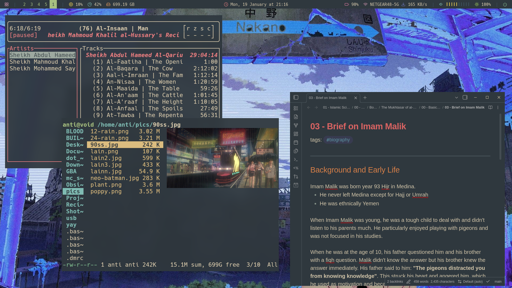
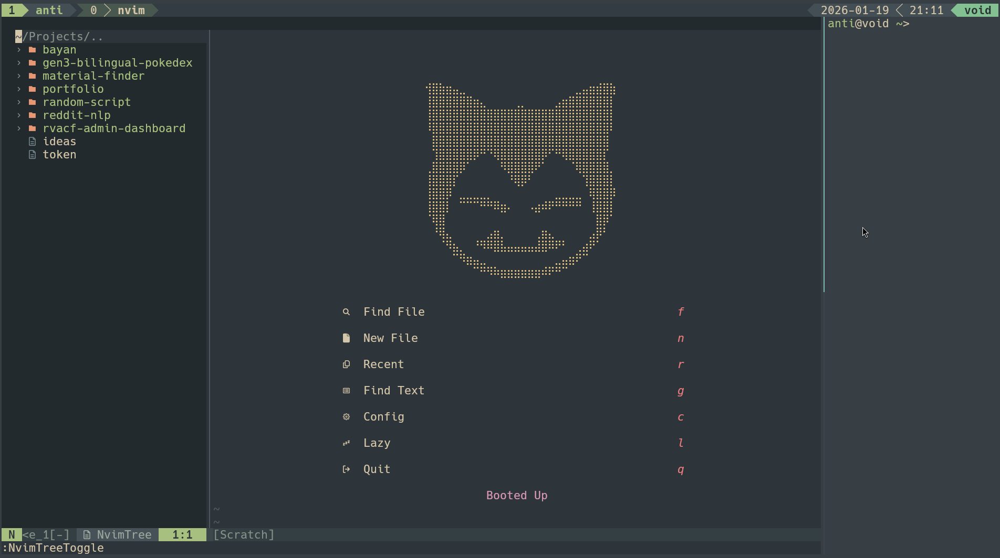

## Screenshots

---
## Configs & Fonts

1. `fish`: alternate to bash shell
2. `i3`: window manager
3. `kitty`: terminal
4. `polybar`: status bar
5. `rofi`: lightweight dynamic menu
6. `obsidian`: note-taking app
7. `ranger`: terminal file manager
8. `picom`: lightweight standalone compositor
9. `Xmodmap`: keyboard mappings config
10. `fonts/Hack`: font for system
11. `fonts/Feather`: include icons needed for `polybar` config

---
## Useful Apps

1. `redshift`: allow for warm screen coloring
2. `feh`: set up desktop background
3. `xclip`: for copying to clipboard
4. `timeshift`: create system snapshots for when NVIDIA drivers brick your new install
5. `vlc`: video and audio player
6. `onboard`: on-screen keyboard for helping with Arabic typing
7. `pavucontrol`: GUI for volume control
8. `arandr`: GUI for HDMI
9. `pillow`: for image preview support in `kitty`
10. `unzip`: unzipping `.zip`
11. `yay`: install anything not available with `pacman`
12. `ncdu`: manage storage (should use with `sudo` to access all directories)
13. `fuse`: required for `obsidian`
14. `autotiling`: automatic tiling when opening new windows

